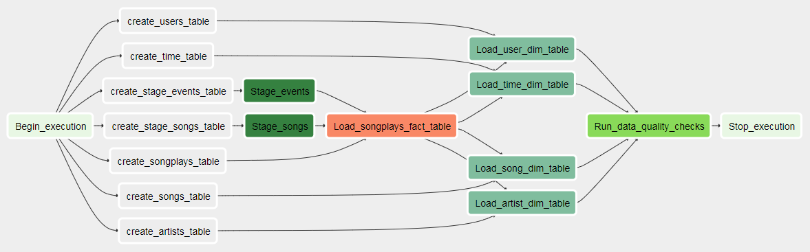
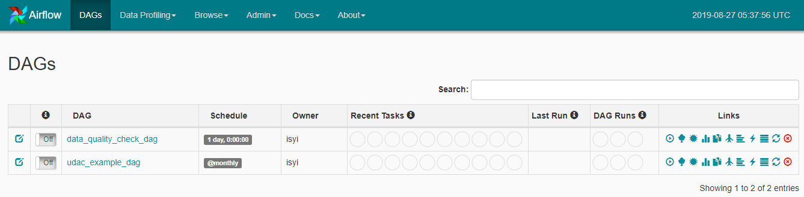
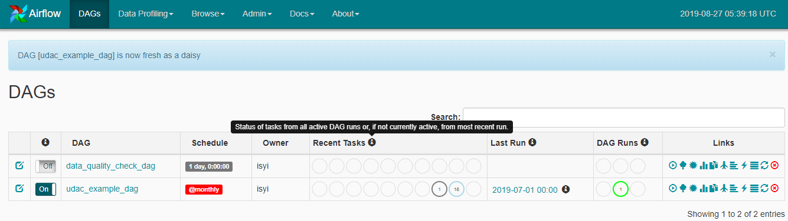

# apache_airflow_example
An example of Apache Airflow for loading S3 data into Apache Redshift and transform

# Data Pipeline with Apache Airflow
This project is for building a sample data pipeline using Apache Airflow.

## Project Introduction
A music streaming company, Sparkify, has decided that it is time to introduce more automation and monitoring to their data warehouse ETL pipelines and come to the conclusion that the best tool to achieve this is Apache Airflow.

## Project Goal
Using Apache Airflow, create high grade data pipelines that are dynamic and built from reusable tasks, can be monitored, and allow easy backfills. After ETL steps done, run data quality check to make sure the integrity of data.

## Data source
The source data resides in S3 and needs to be processed in Sparkify's data warehouse in Amazon Redshift. The source datasets consist of JSON logs that tell about user activity in the application and JSON metadata about the songs the users listen to.

## About Apache Airflow
[Excerpt from Apache Airflow Documentation](https://airflow.apache.org/)

#### 1. What is Apache Airflow
Airflow is a platform to programmatically author, schedule and monitor workflows.

Use airflow to author workflows as directed acyclic graphs (DAGs) of tasks. The airflow scheduler executes your tasks on an array of workers while following the specified dependencies. Rich command line utilities make performing complex surgeries on DAGs a snap. The rich user interface makes it easy to visualize pipelines running in production, monitor progress, and troubleshoot issues when needed.

When workflows are defined as code, they become more maintainable, versionable, testable, and collaborative.

#### 2. Apache Airflow Components


  - <b>Scheduler</b> orchestrates the execution of jobs on a trigger or schedule. The Scheduler chooses how to prioritize the running and execution of tasks within the system. You can learn more about the Scheduler from the official [Apache Airflow documentation](https://airflow.apache.org/scheduler.html).
  - <b>Work Queue</b> is used by the scheduler in most Airflow installations to deliver tasks that need to be run to the Workers.
  - <b>Worker</b> processes execute the operations defined in each DAG. In most Airflow installations, workers pull from the work queue when it is ready to process a task. When the worker completes the execution of the task, it will attempt to process more work from the work queue until there is no further work remaining. When work in the queue arrives, the worker will begin to process it.
  - <b>Database</b> saves credentials, connections, history, and configuration. The database, often referred to as the metadata database, also stores the state of all tasks in the system. Airflow components interact with the database with the Python ORM, [SQLAlchemy](https://www.sqlalchemy.org/).
  - <b>Web Interface</b> provides a control dashboard for users and maintainers. Throughout this course you will see how the web interface allows users to perform tasks such as stopping and starting DAGs, retrying failed tasks, configuring credentials, The web interface is built using the [Flask web-development microframework](http://flask.pocoo.org/).
  
## Datasets

#### 1. Song Dataset
This data is a real data from the [Million Song Dataset](http://millionsongdataset.com/). Each file is in JSON format and contains metadata about a song and the artist of that song. The files are partitioned by the first three letters of each song's track ID. For example, here are filepaths to two files in this dataset.

```
song_data/A/B/C/TRABCEI128F424C983.json
song_data/A/A/B/TRAABJL12903CDCF1A.json
```

And below is an example of what a single song file, TRAABJL12903CDCF1A.json, looks lik

```
{"num_songs": 1, "artist_id": "ARJIE2Y1187B994AB7", "artist_latitude": null, "artist_longitude": null, "artist_location": "", "artist_name": "Line Renaud", "song_id": "SOUPIRU12A6D4FA1E1", "title": "Der Kleine Dompfaff", "duration": 152.92036, "year": 0}
```

#### 2. Log Dataset
Log files in JSON format generated by this [event simulator](https://github.com/Interana/eventsim) based on the song dataset. These simulate app activity logs from an imaginary music streamin gapp based on configuration settings.

Log files are partitioned by year and month. For example, here are filepaths to two files in this dataset.

```
log_data/2018/11/2018-11-12-events.json
log_data/2018/11/2018-11-13-events.json
```

And below is an example of what the data in a log file, 2018-11-12-events.json, looks like.


## Data Lineage (Graphic View of DAG)



## Project Steps

#### 1. Start DAG

  - A dummy task just for representing a start of a dag run
  
#### 2. Create tables

  - Create Amazon Redshift tables for staging and dimension/fact tables

#### 3. Load S3 files into staging tables

  - Read Song dataset from S3 and load into staging table in Redshift
  - Read Event dataset from S3 and load into staging table in Redshift
  
#### 4. Load songplays fact data

  - Using data in staging tables, build & load songplays fact data
  
#### 5. Load dimension data

  - users, songs, artists dimension data is built using staging data
  - time dimention data is built using staging data and songplays data
  - Because time is relying on songplays data, loading dimension is performed after loading songplay data

#### 6. Check data quality

  - Simple basic data quality is performed
  - In this example, 2 cases are checked: a case where count=0, another case where count > 0

#### 7. End DAG

  - A dummy task just for representing an end of a dag run


## Schema for Song Play Analysis

#### `Fact table`
1. `songplays` 
  - Fields: playid, start_time, userid, level, songid, artistid, sessionid, location, user_agent
  - Only include records with page value is 'NextSong' from Log dataset

#### `Dimension tables`
1. `users`
  - Fields: userid, first_name, last_name, gender, level
  - userid field must be unique
  
2. `songs`
  - Fields: songid, title, artistid, year, duration
  - songid field must be unique
  
3. `artists`
  - Fields: artistid, name, location, lattitude, longitude
  - artistid field must be unique
  
4. `time`
  - Fields: start_time, hour, day, week, month, year, weekday
  - start_time field must be unique

## Project Files

#### 1. DAG's

  - airflow/dags/udac_example_dag.py : Dag file running the whole process
  - airflow/dags/data_quality_check_dag.py : Dag file with data quality check code only

#### 2. SQL file

  - airflow/plugins/helpers/sql_queries.py : File containing table creation and insert queries

#### 3. Operators

  - airflow/plugins/operators/stage_redshift.py : Operator file for loading data from S3 to Redshift
  - airflow/plugins/operators/load_fact.py : Operator file for loading songplays fact data
  - airflow/plugins/operators/load_dimension.py : Operator file for loading dimension data
  - airflow/plugins/operators/data_quality.py : Operator file for checking data quality

## Running Programs
With Apache Airflow running

#### 1. Locate DAG from Airflow dashboard



#### 2. Start DAG


